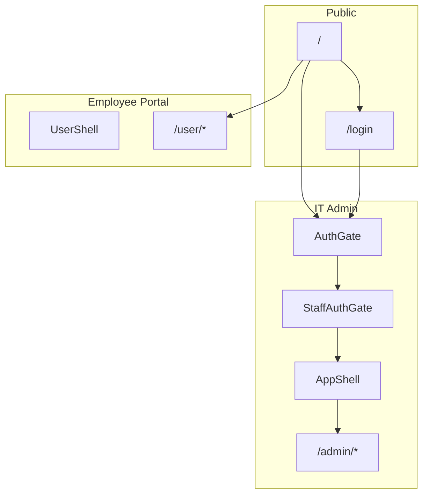

# Asset Desk — UI Improvement Scope

**Project:** aim-asset-tracker-sab-features-assets-desk-firebase-mvp  
**Scope:** Full app (landing, IT auth, IT admin workspace, employee portal)  
**Status:** Complete — Phase 0–9 implemented  
**Last updated:** 2026-05-21

---

## Summary

Improve UI so users always understand **session state**, **loading**, **empty data**, and **errors**—especially the case where the top bar shows a signed-in email but lists show **0 rows** and **“Sign in required.”** Standardize admin pages with shared components, fix entry flows, and remove misleading or non-functional chrome.

---

## Goals

| Goal | Why it matters |
|------|----------------|
| Trustworthy data states | No silent empty tables when auth or API fails |
| Consistent IT admin UX | Same shells, tables, empty states, status badges |
| Clear entry paths | Landing → login → workspace without redirect flashes |
| Honest UI | No fake chart data, fake storage meter, or dead controls |

---

## Non-goals (out of scope)

- Full visual rebrand / new color system (`src/styles.css` tokens stay)
- Kanban ticket board (keep table + sheet)
- Real asset photo pipeline beyond upload CTA + empty state
- Bulk delete/export for assets (remove checkboxes unless product asks)
- Pruning unused shadcn scaffold files

---

## App surfaces in scope



| Surface | Routes | Primary files |
|---------|--------|---------------|
| Landing | `/` | `src/routes/index.tsx` |
| IT sign-in | `/login` | `src/routes/login.tsx`, `src/components/auth/EmailPasswordAuthPage.tsx` |
| IT workspace | `/admin`, `/admin/*` | `src/routes/admin/*`, `src/components/layout/AppShell.tsx` |
| Employee portal | `/user/*` | `src/routes/user/*`, `src/components/layout/UserShell.tsx` |

**Design stack:** `src/components/ui-kit/Card.tsx` (`Card`, `PageHeader`, `StatusPill`) + shadcn subset (`button`, `dialog`, `sheet`, etc.).

---

## Phase 0 — Shared UI foundation

**Do first** — avoids six one-off list-page fixes.

### New components

| Component | Location | Purpose |
|-----------|----------|---------|
| `PageShell` | `src/components/ui-kit/PageShell.tsx` | Padding + max-width (`wide` 1600px, `narrow` 1100px, `portal` lg) |
| `EmptyState` | `src/components/ui-kit/EmptyState.tsx` | Icon, title, description, optional CTA |
| `TableCard` | `src/components/ui-kit/TableCard.tsx` | Card + standard admin table styles |
| `StatCard` | `src/components/ui-kit/StatCard.tsx` | KPI label + value (+ optional icon/delta) |
| `ListPageSkeleton` | `src/components/ui-kit/ListPageSkeleton.tsx` | Skeleton rows while loading |
| `AuthStatusBanner` | `src/components/auth/AuthStatusBanner.tsx` | Auth/API errors with recovery actions |

### Shared logic

| Item | Location | Purpose |
|------|----------|---------|
| Status tone helpers | `src/lib/ui/status-tones.ts` | Ticket, transfer, maintenance, vendor SLA → `StatusPill` tones |

**Replaces duplicated tone mappers in:** `admin/tickets.tsx`, `admin/index.tsx`, `admin/allocation.tsx`, `admin/maintenance.tsx`, `admin/vendors.tsx`.

---

## Phase 1 — Auth, session, and data-loading

**Addresses:** Signed-in topbar + “Sign in required” + empty assets table.

### 1.1 Unify IT auth screens

| Problem | Change |
|---------|--------|
| `AuthGate` spinner + `StaffAuthGate` CTA = double flash on `/admin` | `AuthLoadingScreen` + `AuthRequiredScreen` shared by both |
| Split auth helpers | Align `staff-workspace-auth.ts` and `env.ts` messaging |

**Files:** `src/components/auth/AuthGate.tsx`, `src/components/auth/WorkspaceRoleGuard.tsx`, new `src/components/auth/AuthScreens.tsx`

### 1.2 Landing and login

| Problem | Change |
|---------|--------|
| IT card links to `/admin` | Link to `/login?redirect=/admin` |
| No session awareness on landing | Session strip when staff signed in (email, role, workspace, sign out) |
| Post-login always goes to dashboard | Honor `redirect` search param after sign-in |
| Dead duplicate UI | Remove `src/components/auth/LoginPortalChooser.tsx` |

**Files:** `src/routes/index.tsx`, `src/components/auth/EmailPasswordAuthPage.tsx`, `src/components/auth/AuthSessionCard.tsx`

### 1.3 IT shell session feedback

| Problem | Change |
|---------|--------|
| Notifications fetch before session ready | `useAuthQueryEnabled()` on Topbar query |
| Sign out hidden on small screens | Sign out always reachable on mobile |
| Auth errors only on Assets page | `AuthStatusBanner` on all list pages |

**Files:** `src/components/layout/Topbar.tsx`, admin list routes

### 1.4 Employee portal copy

| Problem | Change |
|---------|--------|
| Copy implies Firebase employee login | Clarify: work email stored on **this device only** |
| Confusion vs IT login | Note in `PortalIdentityCard` — not linked to IT Firebase account |

**Files:** `src/routes/user/_portal/index.tsx`, `src/components/user/PortalIdentityCard.tsx`

---

## Phase 2 — Layout and navigation (IT admin)

### 2.1 Mobile navigation

- `MobileAdminNav` sheet from Topbar menu icon
- Single nav config shared with `AppSidebar` (extract `admin-nav.ts` or shared constant)

**Files:** new `src/components/layout/MobileAdminNav.tsx`, `AppSidebar.tsx`, `Topbar.tsx`

### 2.2 Chrome cleanup

| Element | Action |
|---------|--------|
| Sidebar “6.4 GB / 10 GB” | **Remove** (not real data) |
| Topbar `⌘K` | **Remove** until command palette exists |
| Topbar search placeholder | **Narrow** to “Search assets…” **or** extend to tickets/employees |

### 2.3 Page width

- Admin lists: `PageShell variant="wide"`
- Settings: `PageShell variant="narrow"` (document why in component comment)

---

## Phase 3 — Admin list pages (loading, empty, errors)

**Standard pattern:**

```
authReady → query enabled → loading ? skeleton : error ? AuthStatusBanner : empty ? EmptyState : table
```

| Page | File | Empty state | Extra |
|------|------|-------------|-------|
| Assets | `admin/assets.tsx` | No matches / no assets yet | URL sync for `q`; filter chips; disable Add for viewers; remove dead checkboxes |
| Tickets | `admin/tickets.tsx` | No tickets yet | Empty main table (not only sheet) |
| Allocation | `admin/allocation.tsx` | No transfer requests | Banner when `?assetId=` + clear filter |
| Maintenance | `admin/maintenance.tsx` | No maintenance jobs | Same assetId banner |
| Employees | `admin/employees.tsx` | No employees | Delete confirm dialog |
| Vendors | `admin/vendors.tsx` | No vendors | `callAuthenticatedServerFn` on mutations; delete confirm |
| Settings audit | `admin/settings.tsx` | No audit entries | — |

---

## Phase 4 — Assets (core product)

### 4.1 Assets list

- Active **filter chips** (category, status, warranty, department)
- Table columns: **Status**, **Category**, **Assigned to** (desktop)
- Distinguish auth error vs server error via `AuthStatusBanner`

### 4.2 Asset detail (`admin/assets.$id.tsx`)

| Issue | Change |
|-------|--------|
| Placeholder “Asset Image” | `EmptyState` + upload CTA when storage on |
| Duplicate audit sections | Single timeline + “View all” |
| Raise Ticket | `/admin/tickets?assetId={id}` + dialog prefill |
| Documents (Firebase off) | Muted panel consistent with other empty states |

---

## Phase 5 — Dashboard (`admin/index.tsx`)

| Issue | Change |
|-------|--------|
| `pieDataFallback` fake data | Chart empty state only — never fake numbers |
| Maintenance chart | Clear “ticket volume proxy” subtitle |
| Empty recent tickets | `EmptyState` in table |
| Portal ticket popup | Keep; add “Dismiss all”; fix small-screen overlap |

Use `StatCard` + centralized status tones.

---

## Phase 6 — Tickets, allocation, maintenance

- **Tickets:** Asset ID → link to detail; attachments tab → `EmptyState` not “coming soon”; optional table-only skeleton
- **Allocation / maintenance:** Shared `AssetContextBanner` when `search.assetId` set

---

## Phase 7 — Employees, vendors, reports, settings

- **Employees / vendors:** `PageShell`, admin-only action affordances
- **Reports:** Chart empty states; export disabled + tooltip when no data
- **Settings:** Scannable Firebase status rows; seed admin-only; viewer read-only banner on org form

---

## Phase 8 — Employee portal

| Page | Changes |
|------|---------|
| Portal home | `PageHeader` with optional `centered` |
| Request support | Step copy: Identity → Issue → Submit |
| Tickets | `EmptyState`, shared `StatusPill` tones |
| Identity | Privacy note (cleared on IT sign-out same browser) |

**No** Firebase employee login unless product scope changes.

---

## Phase 9 — Accessibility and polish

| Area | Changes |
|------|---------|
| Login | `main#main-content`, email `autoFocus`, form `aria-busy` / `aria-label`, spinner `aria-hidden` |
| Mobile nav | Menu `aria-expanded` / `aria-controls`; sheet focus moves to first link; `onOpenAutoFocus` defers to nav |
| Destructive actions | `button-hierarchy.ts`; red confirm + trash icons on assets, employees, vendors |
| Tables | `TableCard` scroll region (`role="region"`, `tabIndex`, `min-w-[640px]`) on allocation, maintenance, vendors, tickets, settings audit, assets |
| Loaders | `LoadingIndicator` (`role="status"`, `aria-busy`, `aria-label`) on ticket sheet + portal tickets list |
| Dashboard | Recent tickets table scroll region + `min-w` |

---

## Implementation order

1. **Phase 0** — Primitives + `status-tones.ts`
2. **Phase 1** — Auth + landing + session (highest pain)
3. **Phase 3 + 4.1** — Assets list
4. **Phase 2** — Mobile nav + chrome cleanup
5. **Phases 5–8** — By feature area
6. **Phase 9** — A11y pass

---

## Task checklist

| ID | Task | Phase | Status |
|----|------|-------|--------|
| T1 | Add ui-kit primitives + `AuthStatusBanner` | 0 | Done |
| T2 | Add `status-tones.ts` and migrate routes | 0 | Done |
| T3 | Unify auth screens; redirect param; gate notifications | 1 | Done |
| T4 | Landing → login; session strip; remove `LoginPortalChooser` | 1 | Done |
| T5 | Mobile nav; remove fake storage + ⌘K | 2 | Done |
| T6 | Assets list: skeleton, empty/error, URL `q`, chips, permissions | 3–4 | Done |
| T7 | Other admin lists: empty/loading/error pattern | 3 | Done |
| T8 | Asset detail + dashboard chart honesty | 4–5 | Done |
| T9 | Employee portal copy + headers + empty states | 8 | Done |
| T10 | Delete confirms; table scroll; aria | 9 | Done |

---

## Success criteria

- [ ] Signed-in IT user with valid token sees data **or** a clear recoverable error — never silent 0 rows
- [ ] Unauthenticated user reaches **login** from landing IT path, not empty admin shell
- [x] Every admin list has skeleton, empty state, and error banner
- [x] Mobile user can navigate all admin sections without typing URLs
- [x] Employee portal never implies Firebase employee accounts
- [x] No fake chart or sidebar metrics

---

## Related docs

- [FIREBASE_SETUP.md](./FIREBASE_SETUP.md) — Auth, roles, Firestore seed
- [PROJECT_SCOPE_AND_REQUIREMENTS.md](./PROJECT_SCOPE_AND_REQUIREMENTS.md) — Product requirements (if present)
